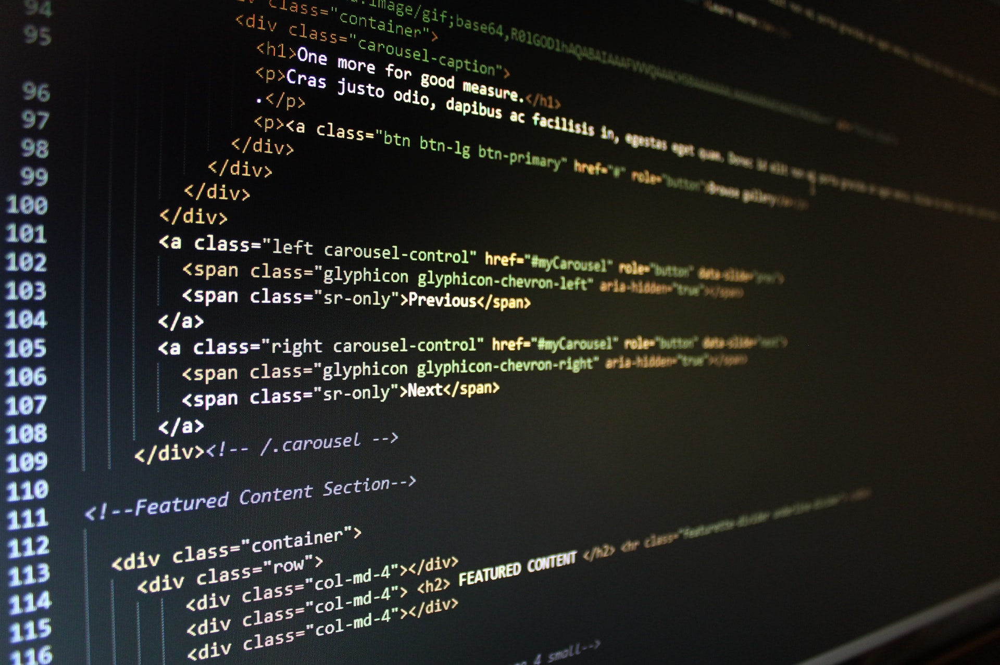

```{r setup, include=FALSE}
knitr::opts_chunk$set(echo = FALSE)
```


(Photo by Pixabay: https://www.pexels.com/photo/turned-on-computer-monitor-displaying-text-270360/)

Building a website seems to be one of the fundamental basics that one must have at this point in the 21st century. A website for your business. A website for your portfolio of projects. I had attempted to make websites in the past, mostly for the times I had considered becoming a content creator, or when I fell for the allure and ease-of-use of Apple's iWeb (this is where I date myself), but those endeavours quickly fell apart. It was a combination of no clear focus for those websites, and the amount of time that I would have to spend on them.

Now, however, I have found a purpose for building a website. I am looking to break ground on my future career as a data analyst or data scientist, and it is imperative to have a central, aesthetically-pleasing looking place to highlight my projects and competencies, as well as my thoughts (like through this here blog) and ways to get in contact with me. Thus, a website is a must. And, with my intermediate knowledge of R and RStudio, what better way to put that knowledge into practice than by building a website using both R and RStudio?

Thus, this journey started. After consulting various articles and tutorials (that will eventually be linked here once the site is a bit more polished), the website has officially made its internet debut! There's nothing too fancy here at the moment, but it shall soon be filled to the brim with more blog posts, projects (such as my educational projects and Tidy Tuesday submissions), biography, contact information, etc. So please, grab some snacks and drinks that I've set out on the table there, and take a look around!
