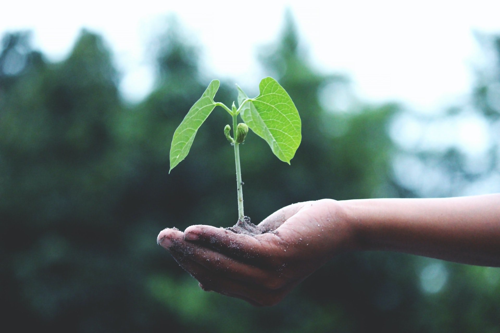

```{r setup, include=FALSE}
knitr::opts_chunk$set(echo = FALSE)
```


(Photo by Akil  Mazumder: https://www.pexels.com/photo/person-holding-a-green-plant-1072824/)

Today is Earth Day. A day when we reflect upon the state of our planet. With the climate crisis we are facing today, it can seem that the future is bleak, especially for the young generations that will face the brunt force of a warmer planet. However, I would like to highlight the positives, the reasons to have hope that, while we may not be able to prevent all the consequences of climate change, we can at least unite together to mitigate the most harmful outcomes. We have become more conscious of our impact on the well-being of Earth's diverse biosphere, and are taking steps to help in any way we can to reduce that impact, whether it be buying an electric vehicle, shopping with reusable bags, planting trees, recycling, etc. It is not futile. It is not too late. Through hope and action, we can help preserve the only planet that we call home, Earth.

Pivoting from Earth Day, I have decided to continue posting at least one blog a day, every day! There are no guarantees for this, but I am striving to keep this up as not only an exercise in writing, but also in communicating my thoughts and ideas to the world. Thus, it will be an integral part of this website. And speaking of the website, major progress has been made in building out the rest of the website's sections. Of course, this will be a continuing endeavour as time progresses.

That's a wrap for this post!
